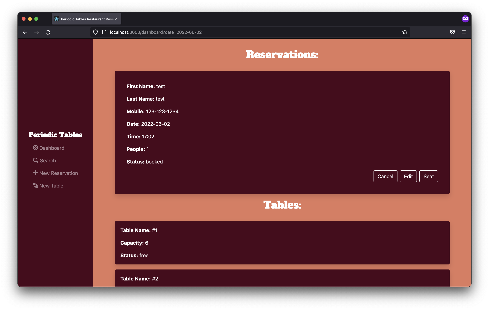
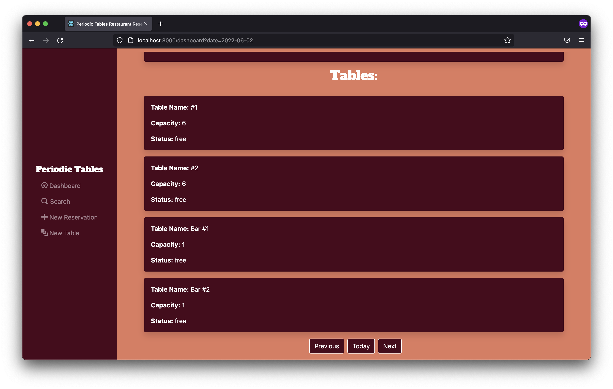
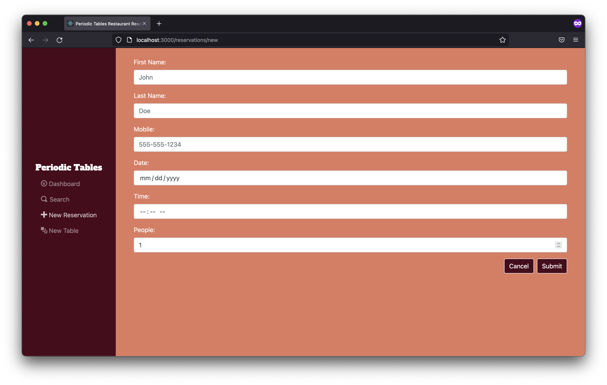
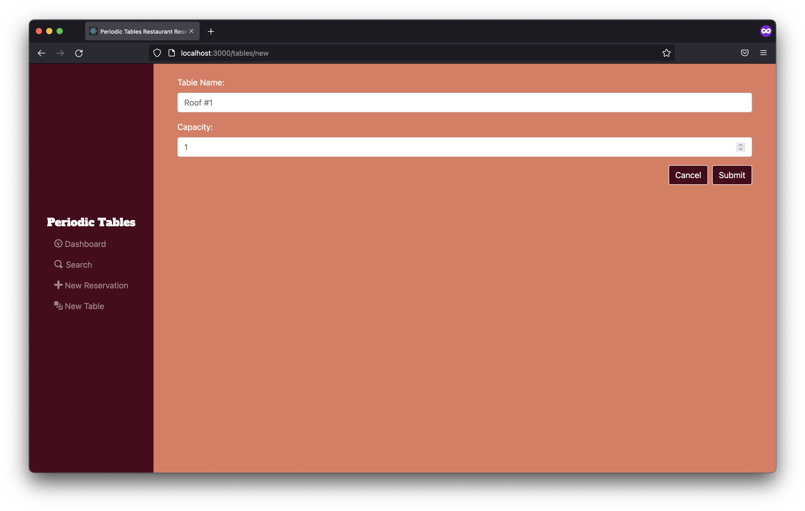
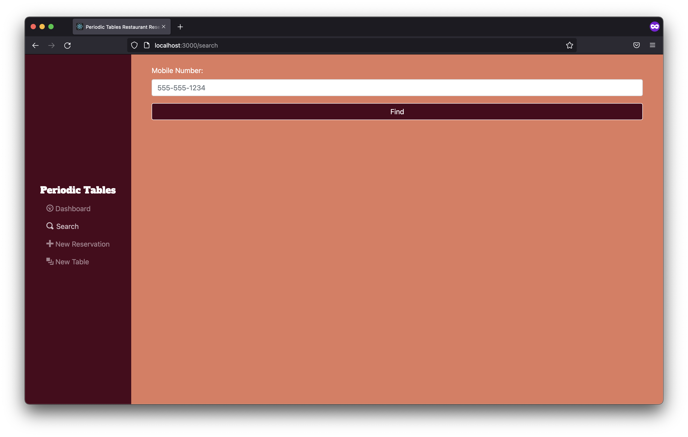

# Restaurant Reservation System
- [Restaurant Reservation System](#restaurant-reservation-system)
- [App Utility](#app-utility)
- [API Documentation](#api-documentation)
- [Screenshots](#screenshots)
- [Tech Stack](#tech-stack)
- [Installation](#installation)
- [Demo](#demo)

# App Utility
This applications was built to help resturant owners manage reservations and tables for their business.

 We can track old and new reservations, and create any that are needed. In addition, we can track the restaurant's tables along with what reservation is assigned to it. If we ever have an increase in capacity, we can add additonal tables as well.

 The last feature allows us to search for any previous reservation. This is ideal if the client ever wants to research all possible reservations taken.

# API Documentation
>Please refer to the Swagger UI for API Documentation.
>[https://thinkful-capstone-backend.herokuapp.com/api-docs](https://thinkful-capstone-backend.herokuapp.com/api-docs)

# Screenshots
1. **Shows reservations for the day.**

2. **Shows tables available.**

3. **Allows user to create new reservations.**

4. **Allows user to create new tables.**

1. **Allows user to search all reservations.**

# Tech Stack

- Frontend
  - ReactJS
  - Bootstrap
  - Puppeteer
- Backend
  - NodeJS
  - Express
  - Swagger
- Database
  - PostgreSQL (ElephantSQL)
  
# Installation

1. Fork and clone this repository.
1. Run `cp ./back-end/.env.sample ./back-end/.env`.
1. Update the `./back-end/.env` file with the connection URL's to your ElephantSQL database instance.
1. Run `cp ./front-end/.env.sample ./front-end/.env`.
1. You should not need to make changes to the `./front-end/.env` file unless you want to connect to a backend at a location other than `http://localhost:5001`.
1. Run `npm install` to install project dependencies.
1. Run `npm run start:dev` to start your server in development mode.

If you have trouble getting the server to run, reach out for assistance.

# Demo
>To see a live version of the application, click
>[here.](https://thinkful-capstone-frontend.herokuapp.com)